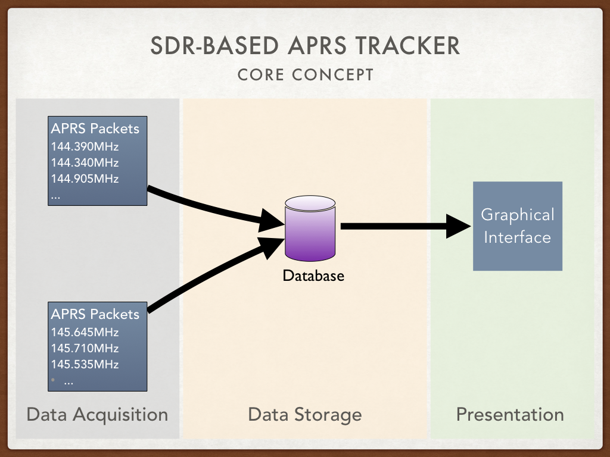
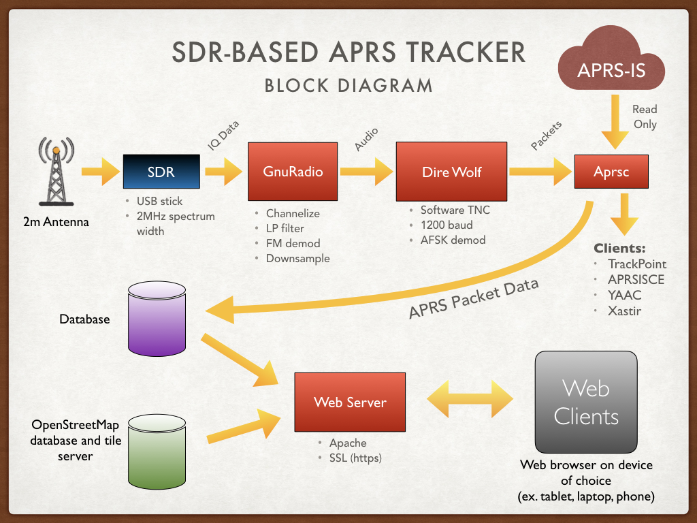

# HAB Tracker

## Introduction ##

The HAB Tracker application aids tracking and recovery of high altitude balloons by leveraging open source software and the amateur radio 
[Automatic Packet Reporting System](http://www.aprs.org) to provide near real time status and location updates.

[Edge Of Space Sciences](https://www.eoss.org) uses the HAB Tracker application to help fulfill their mission of promoting science and education through high altitude balloons and amateur radio.

Primary features:
 - Software based (no traditional radios)
 - Simultaneous reception of APRS packets on multiple frequencies
 - Offline maps
 - Landing predictions
 - Receive only, nothing is transmitted over the air or uploaded to the Internet
 - Light weight user interface leverages a web browser

Where to next?  Visit one of these links:
- [Update your system](docs/EOSS-Upgrades-and-Code-Branches.md) to enable switching to the development code branch.  
New features are available within the `dev` branch like APRS Igating, external radio connections, map waypoints, and 
numerous other fixups.  Follow this guide to enable quick switching between production and development code branches.
- [Using a home wifi network](docs/EOSS-SDR-Tracker-WiFi.md) with your Kansung computer system.  The Kansung SDR
Tracker system will automatically start a wifi hotspot for use in the field where network and Internet connectivty is no 
where to be found.  However, when not in an offline / out-in-the-sticks condition, it would be nice for the system to join your home or business wifi network.  This guide will help you change your Kansung system so that it can automatically switch between your home-based wifi network and hotspot modes.
- [Tethering your USB cellphone](docs/EOSS-SDR-USB-Cellphone-Tether.md) to the Kansung computer can be very advantegous if 
you need to get your system connected to the Internet while out in the field (ex. you're running it as an APRS Igate).  This guide outlines  how to get the Kansung system configured to automatically connect to the Internet through your USB connected, cellphone.

## Architecture ##

The following sections describe the architecture of the system.

### Separation of Data Acquisition and Front-end Interface
One of the core concepts with the HAB Tracker application is that it provides separation between ongoing data acquisition
processing tasks and the front-end user interface.  This allows amateur radio APRS packets across multiple frequencies to 
be processed as they are received without interference from what the end-user might be doing on the 
front-end interface. 

A key component of the architecture is the centralized database which stores all incoming APRS packet data enabling 
parallel access for other processing tasks and the presentation layer.  This approach allows the
front-end interface to query and display data independently, providing a smooth end-user experience.

### Block Diagram
The following diagram shows the primary processing chain and how data is ultimately presented to the end user.

