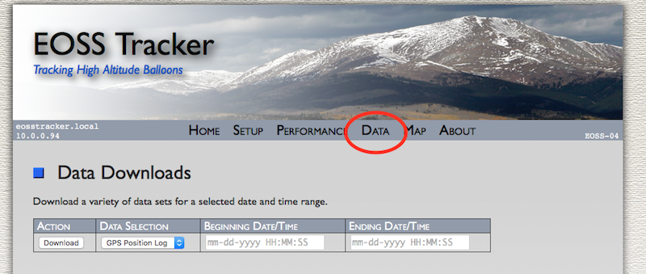
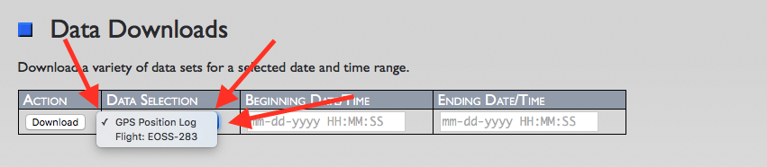
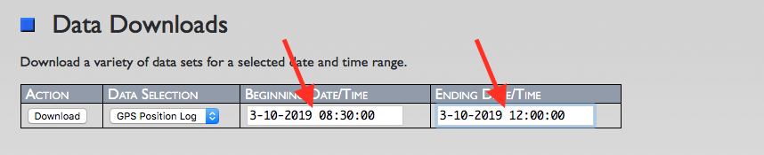
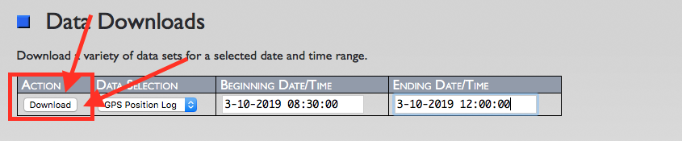

# Downloading GPS and Flight Data #

Notes by Jeff N6BA, Dated 2019-03-12

## Overview ##
All data collected for flights is available for download from the SDR system through the web-based user interface.  In
addition, the GPS logs are also available for download.  All data is in comma
delimited format (CSV).

#### Flight Data ####

Flight data contains every APRS packet captured by the SDR system from every callsign (i.e. beacon) listed as belonging to
this particular flight.  A number of fields are broken out for convenience as well as the raw APRS packet itself.  Regardless 
of how an APRS packet enters the SDR system (ex. over RF or via an Internet connection to APRS-IS servers), that data is 
available for download.

Scroll to the right as the flight data table below is too wide for most screens ------>

| datetime | flightid | callsign | aprs_symbol | speed_mph | bearing | altitude_ft | lat | lon | comment | md5_hash | raw_packet |
| -------- | -------- | -------- | ----------- | --------- | ------- | ----------- | --- | --- | ------- | -------- | ---------- |
| 2019-03-10 08:30:02 | EOSS-283 | KC0D-14 | /O | 0 | 0 | 4929 | 40.473633 | 104.962767 | EOSS BALLOON | a8dbaa71615941b0faebdbea74fdc2d1 | KC0D-14>APZEOS,EOSS,qAO,N2XGL01:/143000h4028.41N/10457.76WO000/000!W86!/A=004929 EOSS BALLOON |
| 2019-03-10 08:30:02 | EOSS-283 | KC0D-2 | /O | 1.15 | 18 | 4918 | 40.473667 | 104.962833 | EOSS BALLOON | 1e5f091ebfcb7ae441dca248f370a43a | KC0D-2>APZEOS,EOSS,qAO,N2XGL04:/143000h4028.42N/10457.77WO018/001/A=004918 EOSS BALLOON |
| 2019-03-10 08:30:04 | EOSS-283 | KC0D-14 | | 0 | 0 | 0 | 0 | 0 | | 5bd3a11240dc2396837bff3ec8106776 | KC0D-14>APZEOS,EOSS,qAO,N2XGL01:>143000 Lk=3Diff/14 Itemp=59F bAlt=4792Ft Rel:7.5V 8.0V |
| 2019-03-10 08:30:11 | EOSS-283 | AE0SS-13 | /O | 0 | 0 | 4942 | 40.473867 | 104.962817 | EOSS Baloon | 518a58a8c20fc42d46f6bf9c3f580fba | AE0SS-13>APTT4,EOSS,qAO,N2XGL00:/143010h4028.43N/10457.76WO000/000EOSS Baloon/A=004942!W29! |

#### GPS Logs ####

GPS data is available for download and includes all the usual fields for location and movement data the SDR system 
has been experiencing (i.e. when it's installed within a moving vehicle).  Satellite fix status is not currently saved within 
the GPS logs at this time.  

Although GPS latitude and longitude data is saved to a 6-digit resolution, a new GPS log 
entry is only created when the location has changed by greater than approximately 10 meters (or 4 decimal places for lat/lon 
figures).  In addition, the frequency that new GPS log entries are created is limited about 2 seconds.

| datetime | speed_mph | bearing | altitude_ft | lat | lon |
| -------- | --------- | ------- | ----------- | --- | --- |
| 2019-03-10 08:30:01 | 58 | 24 | 4221 | 40.293141 | -103.593831 |
| 2019-03-10 08:30:03 | 58 | 17 | 4221 | 40.293579 | -103.593626 |
| 2019-03-10 08:30:05 | 58 | 9  | 4222 | 40.294036 | -103.593495 |

## Downloading Data ##

### Select The "Data" Menu Option ###

Your first task is to click on the "Data" menu option within the user interface:

Once on the Data screen there is a form that allows for selection of:
- The type of data one desires to download (ex. GPS logs or flight data)
- A date and time range that includes a beginning date/time and an ending date/time

### Select Desired Data Type ###

Next, select the type of data you want to download from the SDR system by clicking the dropdown menu option.  This dropdown
will contain selections for GPS log data as well as any flights that are currently being tracked 
(see the Setup->Flights menu option).

### Enter Desired Date/Time Range ###

Enter the desired date/time range to download.  Be aware that entering a very large range will mean downloading a 
potentially large number of rows of CSV data.

### Click Download ###

Finally click the "Download" button to begin downloading the CSV data selected.  Depending upon the web browser being used,
a file might be saved to your "Downloads" directory or a new browser tab will be opened containing the CSV data.

