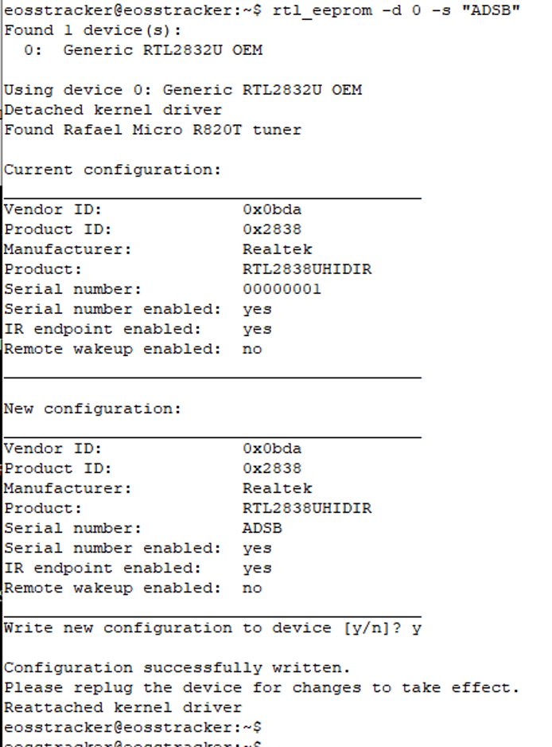
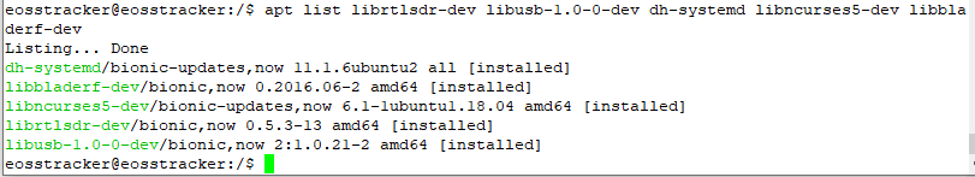
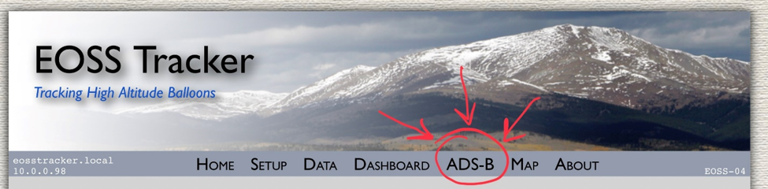
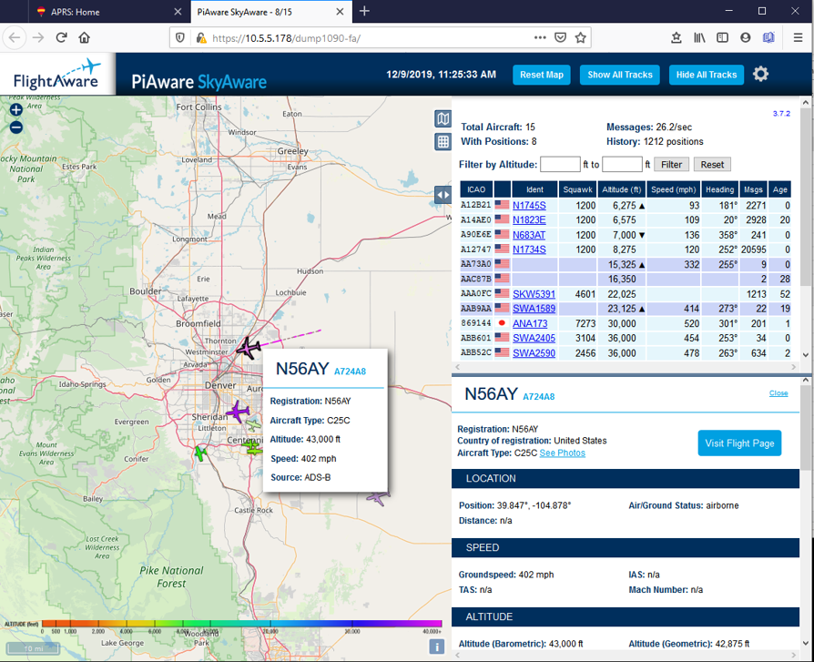
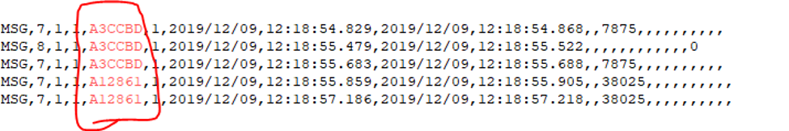

# Installing an ADS-B Application on the EOSS SDR Tracker System

Application Notes by Marty WA0GEH,
Version 1.0, Dated 2019-12-11

## Installing dump1090 for ADS-B decoding

These instructions, provided by Jeff Deaton, N6BA and Jeff Shykula, N2XGL,
enable the EOSS SDR Tracking system to monitor ADS-B position reports from
active aircraft flights.  From an ADS-B tab on the Web page, a user can
observe flight data on a locally-hosted FlightAware screen.  This capability
runs concurrent with the original APRS tracking application.  It is only
available in Version 1.3 or the `dev` branch.

### Required Hardware

Additional hardware items need to be provided to enable ADS-B capability:

1. The EOSS APRS SDR Tracking system must be either at Version 1.3 or
configured for the `dev` branch to qualify for this installation.
See [here](https://github.com/TheKoola/eosstracker/blob/master/doc/EOSS-Upgrades-and-Code-Branches.md)
for information about software upgrades and the `dev` branch from GitHub.

2. A second USB SDR receiver to be used to receive data in the 1090 MHz range.  
This can be the same model USB SDR deployed for the APRS frequencies.  
These instructions apply to this device. It can be ordered here:
[link](https://www.amazon.com/gp/product/B01HA642SW/ref=ppx_yo_dt_b_asin_title_o00_s00?ie=UTF8&psc=1)

Optionally, you can order the FlightAware Pro Stick USB ADS-B Receiver from here:
[link](https://www.amazon.com/FlightAware-Pro-Stick-ADS-B-Receiver/dp/B01D1ZAP3C)

3. An antenna resonant on 1090 MHz connected to that USB dongle.

4. Optionally, consider a bandpass filter to block the 144/440 MHz
transmissions from other antennas on your vehicle roof.  Here is one example:
[link](https://www.amazon.com/gp/product/B010GBQXK8/ref=ppx_yo_dt_b_asin_title_o04_s00?ie=UTF8&psc=1)

### Installation Process

The steps to install the ADS-B application are as follows:  (Details to follow
below)

1. Download the latest upgrades on the APRS SDR Tracker
2. Configure the ADS-B USB SDR for a Serial Number String “ADSB”
3. Install dump1090-fa on the APRS SDR Tracker System
4. Test the new application
5. To filter the data for an ICAO address

Proceed with the installation steps below.

#### Download the latest upgrades on the APRS SDR Tracker

It is always important to perform an upgrade of the EOSS APRS SDR software
before performing any software additions.  As a reminder:

1. Connect the brick to the Internet via the Ethernet connector
2. Open a terminal session via direct connection (HDMI + Keyboard) or
by a terminal emulator such as PuTTY.
3. Log onto the brick with the credentials username `eosstracker` and
the password that was provided.
4. At the prompt, enter each of the following
```
sudo apt update
sudo apt -y upgrade
reboot
```
5. Remain connected to the brick to perform the following steps to
install the ADS-B software.

Your brick should up to date.

#### Configure the ADS-B USB SDR for a Serial Number String "ADSB"

You will need to configure the serial number "ADSB" for your new,
second SDR receiver.  Follow these step to perform this configuration task.

1. Shut down the brick by entering `poweroff`.
2. Remove your original USB SDR Receiver and replace it with your new
(second) USB SDR Receiver.  This will enable you to configure the new
USB SDR Receiver that will be used for ADS-B.
3. Connect your new SDR Receiver to the ADS-B antenna (or via the
bandpass filter if you have implemented it).  
4. Power on your brick, reconnect to your terminal session and log in.
5. From the command prompt, enter:  `rtl_eeprom -d 0 -s "ADSB"`  The resultant
output should look like this:

<p align="center">

</p>

6. Note the new Serial number is `ADSB`.  You are asked to "replug the device
for changes to take effect".  Replug the device.
7. Shut down the brick by entering `poweroff`
8. Reinsert the original SDR.  You should now have two SDRs inserted into USB
ports.
9. Power on your brick, reconnect to your terminal session and log in.  
10.  To check to see if you now have two SDRs, from the command prompt
enter: `rtl_test`.  You should see "2 devices found".  Press CNTRL-C to
exit the test command.

You are now ready for the dump1090-fa (ADS-B) software installation.

#### Install dump1090-fa on the APRS SDR Tracker System

The installation of dump1090-fa will automatically configure itself to use
the local map server and update the Apache web server to
allow https://eosstracker.local/dump1090-fa to show the graphical,
FlightAware GUI.  Flight locations will be displayed on the local map server GUI.  
Ensure your brick is connected to the Internet.  From the command line,
enter the following commands (Copy and paste OK):
```
sudo apt install librtlsdr-dev libusb-1.0-0-dev dh-systemd libncurses5-dev libbladerf-dev
cd /tmp
git clone https://www.github.com/deatojef/dump1090.git
cd dump1090
git checkout eoss
dpkg-buildpackage -b --no-sign -tc
cd ..
sudo apt install ./dump1090-fa_3.7.2_amd64.deb
```

To verify the installation succeeded, at the command prompt, enter:
`apt list librtlsdr-dev libusb-1.0-0-dev dh-systemd libncurses5-dev libbladerf-dev`
You should see the following response indicating that 5 applications were installed:

<p align="center">

</p>

To verify the dump1090-fa application is running, enter:
`sudo systemctl status dump1090-fa`
You will get a message indicating dump1090-fa is “active (running)”

You are now ready to test the ADS-B application.

### Test the New ADS-B Application

For Version 1.3 users and `dev` branch users, to ensure the new apps have
started, reboot your brick.  The apps should have started as a result of the
installation, but this reboot is to make sure they reliably start each time.  
Follow the steps below to test the installation:
1. Access the EOSS SDR APRS Web page and observe the new menu tab labeled
"ADS-B" at the top of your screen.  The page should look similar to this:

<p align="center">

</p>

2. Click on the tab and a locally-hosted FlightAware page should appear:

<p align="center">

</p>

3. Observe the flight logos and click on one to see the details of that
flight on the map and to the right.

### Filter the Data for a Specific ICAO Address

It may be important to filter flight information and display only flights
we have an interest – such as balloon flights.  EOSS has registered three
tail numbers for future flights:  The three EOSS N-numbers are:
```
Tail number: N991SS, Hex ICAO Address: ADD7FB
Tail number: N992SS, Hex ICAO Address: ADDBB2
Tail number: N993SS, Hex ICAO Address: ADDF69
```
The CU N-Number and ICAO Address is:
```
Tail number: N4615G, Hex ICAO Address: A59EE9
```
As an example, to filter and watch a flight for our balloon (N991SS),
enter the command:

`nc 127.0.0.1 30003 | egrep -i "N991SS"`

To observe the tail number, click on the logo for that flight and note
the number in red or green to the right of the commercial flight number.  This
is the tail number we will use to filter multiple flights.  

For example, to follow A12861 and A3CCBD enter:

`nc 127.0.0.1 30003 | egrep -i "A12861|A3CCBD"`
This command will return data only for those two flights:

<p align="center">

</p>

To save the streaming data to a new file in the current directory, the command
was issued:  

`nc 127.0.0.1 30003 | egrep -i "A12861|A3CCBD" >output.txt`

To append streaming data onto an existing file:

`nc 127.0.0.1 30003 | egrep -i "A12861|A3CCBD" >>output.txt`

You should be well on the way to monitor specific and multiple balloon flights
as they appear on the ADS-B tab.  Give us a shout for any help you might need.

Jeff N6BA, Jeff N2XGL, Marty WA0GEH
