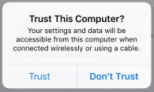

# EOSS SDR Tracker USB Cellphone Tether

Notes by Jeff N2XGL,
Version 1.0, Dated 2019-02-20

## Connecting to your SDR Tracker to the Internet via Cellphone

By default, the EOSS SDR Tracker is configured to automatically
recognize wired Ethernet LAN connections.  When a network cable
is plugged in, the tracker computer will bring up the Ethernet
interface, request an IP address via DHCP, and update the routing
table with a known gateway to the Internet. If the WiFi on the
tracker computer is providing a local hotspot, then all
clients on the WiFi hotspot will also be routed to the
Internet.

It is also very easy to connect cellular data modems and smart phones
to the SDR tracker computer in order to get Internet access.  The baseline 
Ubuntu 18.04 operating system and the Network Manager service provide 
a wide range of drivers and configurations for many cellphones and cellular 
data modem access points.  Most modern smart phones and many access points 
will provide a virtual Ethernet-like interface over a USB connection, which 
the SDR Tracker computer treats just like an Ethernet cable being plugged 
into the unit.  Apple iPhones and iPads require an additional one-time step to
have the computer recognize and connect (see below).

## Connecting a Personal Hotspot to the SDR Tracker computer

Begin by placing your smart phone into "personal hotspot" mode, which
depends somewhat on the individual phone and is beyond the scope of this
application note.  Then connect your smart phone to the SDR tracker computer
with a USB cable, plugging in to any available USB port on the computer.
That's it!  After a couple of minutes, a network connection will be
established.  You can read below about how to list network connections and
devices.

## Connecting an iPhone Personal Hotspot

To connect to Apple iPhones and cellular-enabled iPads, you need to install
some additional software packages onto the SDR Tracker computer.  Once this
is done, connecting an iPhone or iPad in "personal hotspot" mode will behave
automatically.

To install the package, begin by connecting the SDR Tracker computer to the
Internet by any other means (e.g. Ethernet or WiFi).  Follow the 
[EOSS-SDR-Tracker-Wifi.md](EOSS-SDR-Tracker-WiFi.md) guide
for getting your system connected to a local/home-based WiFi network or connect
to a local network using an Ethernet cable inserted into one of the RJ45 ports.
Log into the tracker computer with the `eosstracker` account.

At the command prompt, enter the following command:

`sudo apt-get -y install ipheth-utils`

You will have to enter your password again in order to perform the package
installation as root.

Once the operation completes, you can turn your iPhone or iPad "personal
hotspot" on, and then plug the in the Lightning-to-USB cable into the tracker
computer.  

The first time you plug in your device, you will be prompted to trust the
new computer:



Click on "Trust" and you should be all set.  From now on, whenever you plug
in an iPhone or iPad with personal hotspot turned on, it should be recognzied
and connected.

## Checking the devices and network connections

To check that USB tether devices have connected, enter the command

`nmcli d`

You will see a list similar to

```
DEVICE         TYPE      STATE        CONNECTION
enp1s0         ethernet  connected    Wired connection 1
enp0s20u4c4i2  ethernet  connected    Wired connection 3
wlp2s0         wifi      connected    Home-wifi
enp3s0         ethernet  unavailable  --
lo             loopback  unmanaged    --
```

In this case, `enp0s20u4c4i2` is the USB-tethered phone.  It emulates
an Ethernet connection, and it shows `connected` status.

To see the network connection status, enter the command

`nmcli c show`

and you will see an output similar to
```
NAME                UUID                                  TYPE      DEVICE
Home-wifi           f1f123ab-2889-473a-b881-893678ab3991  wifi      wlp2s0
Wired connection 1  c0f3f448-5744-3345-9567-44c36a372130  ethernet  enp1s0
Hotspot             b734f4bb-b48c-4983-b869-e9872bc7457d  wifi      --
Wired connection 2  86987fe6-b834-3983-a908-96aac5347dd8  ethernet  --
Wired connection 3  4df3cd6c-cfd2-3223-bs46-88cab45dc5c4  ethernet  enp0s20u4c4i2
```

You can see that the device `enp0s20u4c4i2` is connected.  

Other commands such as `dmesg` will show you the kernel messages when you
plugged in the personal hotspot, and `route -n` will should you the 
routing tables, including Internet gateway address information.

##   Exceptions to personal hotspots

There are a large number of USB devices that connect to the Internet over
cellular data.  USB thumb-drive style cellular modems (often used with 
laptop computers) may not present themselves as emulated Ethernet over USB
and instead present as a high-speed modem "mobile broadband" device.  The 
configuration for mobile broadband devices may not be automatic and is
not included in this application note.
