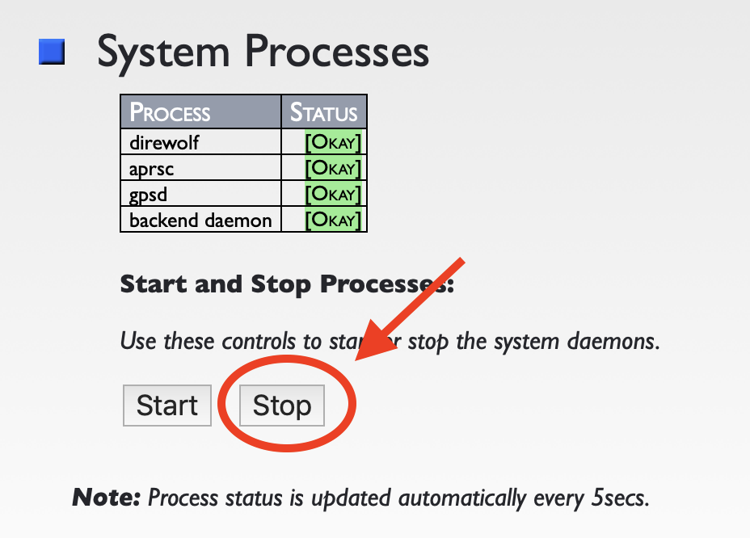
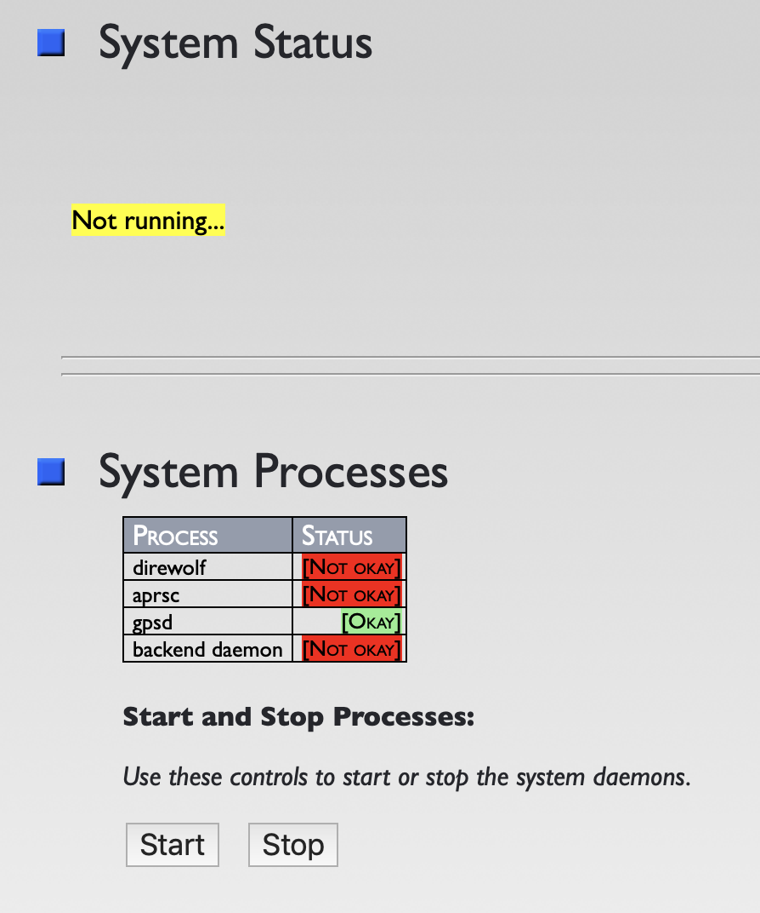

# EOSS SDR Tracker:  Upgrades and Switching Between Production and Development

Notes by Jeff N6BA, Dated 2019-02-18

## Introduction

GitHub is used for version, issue, and feature tracking for the EOSS Tracker 
SDR system code base.  This short guide allows more ambitious users to 
checkout the development code base for use on their individual Tracker 
computer while retaining the ability to switch back to the production 
code base if the need arises.

There are two sections to this guide:
1. Prep work that only needs to be run once.
2. Switching between the production and development code bases.

Using this method, individual users can get access to the latest features as
soon as they're available.

## Prep Work (one-time)

For this section, you'll need to make sure your Tracker computer has access
to the Internet for download of Ubuntu packages.  Follow the 
[EOSS-SDR-Tracker-Wifi.md](EOSS-SDR-Tracker-WiFi.md) guide
for getting your system connected to a local/home-based wifi network or connect
to a local network using an ethernet cable inserted into one of the RJ45 ports.
<p align="center">

</p>

### Shutdown The System Processes

If there are system processes running (check status from the `https://eosstracker.local/` Home page), 
then you will need to stop those prior to executing these steps as the underlying configuration files
will be changing.




Make sure no system processes are running prior to continuing further:




### Login Using SSH

Most likely you don't have a monitor and keyboard connected to the Tracker 
computer which means you'll need to login using SSH.  To connect without 
a keyboard or monitor (i.e. headless), you will need to
have a ssh client software application.  A good one for Windows is 
[PuTTY](https://www.chiark.greenend.org.uk/~sgtatham/putty/).  Apple computers
come with a both a Terminal application and all the usual SSH tools.

If you are connected via "EOSS-xx" on your client computer, you can ssh to
`eosstracker@eosstracker.local` or `eosstracker@10.42.0.1` and provide the
password.  If you are already connected via your local Ethernet LAN, then
you will have to know the IP address that the SDR Tracker was provided.  You
can usually find this out from your router, which will show you a table of
DHCP clients.  Once you know the IP address (e.g. 192.168.8.100) then you can
ssh to `eosstracker@192.168.8.100`.  Most modern home routers support mDNS which 
makes it easy as you can use the `eosstracker.local` hostname.

For example (using an Apple computer to connect):
```
my-macbook-pro$ ssh eosstracker@eosstracker.local
eosstracker@eosstracker.local's password: 
..
..
```

### Prepare The /eosstracker File System

Next run these commands to prepare the /eosstracker file system for use 
with GitHub:

1.  `cd /tmp`
2.  `git clone https://github.com/TheKoola/eosstracker.git`
3.  `cd eosstracker`
4.  `sudo ./cleanandstage.bash`


Changing directories to /tmp:
```
Last login: Wed Jan 30 20:44:37 2019
eosstracker@eosstracker:~$ cd /tmp
eosstracker@eosstracker:/tmp$ 
```

Cloning the repository from GitHub:
```
eosstracker@eosstracker:/tmp$ git clone https://github.com/TheKoola/eosstracker.git
Cloning into 'eosstracker'...
remote: Enumerating objects: 4158, done.
remote: Counting objects: 100% (4158/4158), done.
remote: Compressing objects: 100% (3950/3950), done.
remote: Total 4158 (delta 298), reused 4048 (delta 197), pack-reused 0
Receiving objects: 100% (4158/4158), 11.51 MiB | 519.00 KiB/s, done.
Resolving deltas: 100% (298/298), done.
eosstracker@eosstracker:/tmp$ 
```

Changing to the /tmp/eosstracker directory:
```
eosstracker@eosstracker:/tmp$ cd eosstracker
eosstracker@eosstracker:/tmp/eosstracker$ 
```

Example output from the cleanandstage.bash script:
```
eosstracker@eosstracker:/tmp/eosstracker$ sudo ./cleanandstage.bash
[sudo] password for eosstracker: 
Running apt update...
Hit:1 http://archive.ubuntu.com/ubuntu bionic InRelease
Get:2 http://archive.ubuntu.com/ubuntu bionic-updates InRelease [88.7 kB]
Get:3 http://archive.ubuntu.com/ubuntu bionic-backports InRelease [74.6 kB]
Get:4 http://archive.ubuntu.com/ubuntu bionic-security InRelease [88.7 kB]
Get:5 http://archive.ubuntu.com/ubuntu bionic-updates/main amd64 Packages [525 kB]
Get:6 http://archive.ubuntu.com/ubuntu bionic-updates/universe amd64 Packages [736 kB]
Fetched 1,514 kB in 4s (338 kB/s) 
Reading package lists... Done
Building dependency tree       
Reading state information... Done
58 packages can be upgraded. Run 'apt list --upgradable' to see them.
Installing alsa-utils...
Reading package lists... Done
Building dependency tree       
Reading state information... Done
The following NEW packages will be installed:
  alsa-utils
0 upgraded, 1 newly installed, 0 to remove and 58 not upgraded.
Need to get 966 kB of archives.
After this operation, 2,302 kB of additional disk space will be used.
Get:1 http://archive.ubuntu.com/ubuntu bionic/main amd64 alsa-utils amd64 1.1.3-1ubuntu1 [966 kB]
Fetched 966 kB in 2s (390 kB/s)     
Selecting previously unselected package alsa-utils.
(Reading database ... 177590 files and directories currently installed.)
Preparing to unpack .../alsa-utils_1.1.3-1ubuntu1_amd64.deb ...
Unpacking alsa-utils (1.1.3-1ubuntu1) ...
Processing triggers for ureadahead (0.100.0-20) ...
ureadahead will be reprofiled on next reboot
Setting up alsa-utils (1.1.3-1ubuntu1) ...
alsa-restore.service is a disabled or a static unit, not starting it.
alsa-state.service is a disabled or a static unit, not starting it.
Processing triggers for systemd (237-3ubuntu10.11) ...
Processing triggers for man-db (2.8.3-2ubuntu0.1) ...
Processing triggers for ureadahead (0.100.0-20) ...
Removing pulseaudio...
Reading package lists... Done
Building dependency tree       
Reading state information... Done
The following packages were automatically installed and are no longer required:
  libpulsedsp libtdb1 libwebrtc-audio-processing1 pulseaudio-utils rtkit
Use 'sudo apt autoremove' to remove them.
The following packages will be REMOVED:
  gqrx-sdr pulseaudio
0 upgraded, 0 newly installed, 2 to remove and 58 not upgraded.
After this operation, 6,280 kB disk space will be freed.
(Reading database ... 177664 files and directories currently installed.)
Removing gqrx-sdr (2.9-2) ...
Removing pulseaudio (1:11.1-1ubuntu7.1) ...
Processing triggers for mime-support (3.60ubuntu1) ...
Processing triggers for man-db (2.8.3-2ubuntu0.1) ...
Processing triggers for hicolor-icon-theme (0.17-2) ...
Checking eosstracker permissions and group membership...
Adding user `eosstracker' to group `audio' ...
Adding user eosstracker to group audio
Done.
Adding user `eosstracker' to group `dialout' ...
Adding user eosstracker to group dialout
Done.
Cleaning up /eosstracker...
Already up to date.


On branch master
Your branch is up to date with 'origin/master'.

nothing to commit, working tree clean
eosstracker@eosstracker:/tmp/eosstracker$
```

### If There Are Issues

Pay attention the last bits of output from the cleanandstage.bash script. Specifically, 
look for `working tree clean`.  If you see output similar to that,
then you're in the clear, however,  if there are issues they will likely
be because there some files within the `/eosstracker` filesystem have 
differences.  

For example, the following shows that the `menubar.php` 
file was different (for some reason) than what is in the GitHub
repository.  

```
..
..
On branch master
Your branch is up to date with 'origin/master'.
 
Changes not staged for commit:
  (use "git add <file>..." to update what will be committed)
  (use "git checkout -- <file>..." to discard changes in working directory)
 
        modified:   www/common/menubar.php
 
no changes added to commit (use "git add" and/or "git commit -a")
eosstracker@eosstracker:/eosstracker$
```

To remedy, run the following to pull down a new copy of the offending file
from the GitHub respository.  This will overwrite the existing file, so if 
you've made local modifications and need to save those, copy your local changes 
to some other location prior to running the following:

```
eosstracker@eosstracker:/eosstracker$ git checkout -- www/common/menubar.php
```

### Point of Truth

Running `git status` can provide an easy means to make sure that the directory tree
is clean from local changes, etc.:

``` 
eosstracker@eosstracker:/eosstracker$ git status
On branch master
Your branch is up to date with 'origin/master'.

nothing to commit, working tree clean
eosstracker@eosstracker:/eosstracker$
```


## Switching Between Production and Development

You can now switch your EOSS Tracker computer between production (i.e. the 
GitHub master code branch) and the development (i.e. dev) branches.  Just make 
sure your computer has access to the Internet, login via SSH as before, and run 
the following commands.

Prior to switching between branches or pulling down new updates, make sure to 
stop any system processes if they're running.  


Once finished with the `git` command processes below, you'll likely need to clear 
your web browser cache prior to (re)loading the `https://eosstracker.local/` web pages.
Depending upon the web browser (ex. Internet Explorer, Safari, Firefox, Opera, etc.), one 
might also need to restart browser all together.


### Switching To The Development Branch

Run these commands to switch to the development branch.  You'll need to be within
the `/eosstracker` directory when running these:

1. `git status`
2. `git checkout dev`
3. `git pull`
4. `./fixperms.bash`

For example: 
```
eosstracker@eosstracker:/eosstracker$ cd /eosstracker
eosstracker@eosstracker:/eosstracker$ git checkout dev
Branch 'dev' set up to track remote branch 'dev' from 'origin'.
Switched to a new branch 'dev'
eosstracker@eosstracker:/eosstracker$ git pull
Already up to date.
eosstracker@eosstracker:/eosstracker$ ./fixperms.bash
eosstracker@eosstracker:/eosstracker$
```

Once your web browser cache has been cleared, you should be able to verify the version of 
code branch you're running by looking at the bottom of the `https://eosstracker.local/` web page.
<p align="center">

</p>

### Switching To The Production Branch

Run these commands to switch to the production code branch.  You'll need to 
be in the `/eosstracker` directory when running these:

1. `git checkout master `
2. `git pull`
3. `git status`


For example:
```
eosstracker@eosstracker:~$ cd /eosstracker
eosstracker@eosstracker:/eosstracker$ git checkout master
Switched to branch 'master'
Your branch is up to date with 'origin/master'.
eosstracker@eosstracker:/eosstracker$ git pull
Already up to date.
eosstracker@eosstracker:/eosstracker$ git status
On branch master
Your branch is up to date with 'origin/master'.

nothing to commit, working tree clean
eosstracker@eosstracker:/eosstracker$
```

### Staying Up To Date

There will be times that you will want/need to pull down updates to the
code base in the production or development branches.  There might be important
bug fixes or new features that you want to take advantage of.

To get those updates, log back into the EOSS SDR Tracker computer via SSH and
execute the `git pull` command from within the `/eosstracker` directory.

For example:

```
eosstracker@eosstracker:~$ cd /eosstracker
eosstracker@eosstracker:/eosstracker$ git status
On branch dev
Your branch is up to date with 'origin/dev'.

nothing to commit, working tree clean
```


```
eosstracker@eosstracker:/eosstracker$ git pull
remote: Enumerating objects: 11, done.
remote: Counting objects: 100% (11/11), done.
remote: Compressing objects: 100% (1/1), done.
remote: Total 6 (delta 5), reused 6 (delta 5), pack-reused 0
Unpacking objects: 100% (6/6), done.
From https://github.com/TheKoola/eosstracker
   38d28f7..cd2854f  dev        -> origin/dev
Updating 38d28f7..cd2854f
Fast-forward
 www/common/setup.js | 8 +++++++-
 www/setup.php       | 2 +-
 2 files changed, 8 insertions(+), 2 deletions(-)
```

```
eosstracker@eosstracker:/eosstracker$ git status
On branch dev
Your branch is up to date with 'origin/dev'.

nothing to commit, working tree clean
eosstracker@eosstracker:/eosstracker$
```


