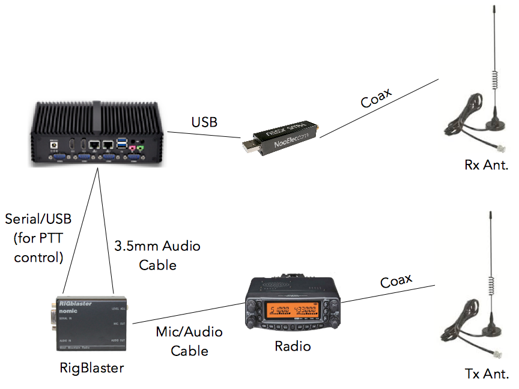

# System Configuration #

Notes by Jeff N6BA, Dated 2019-02-18

## Overview ##

The System Configuration section of the Setup screen allows one to enable two important features:
- Timezone - change the timezone used throughout the GUI interface
- Igating - automatic uploading of RF APRS packets to the Internet
- Beaconing - using an external radio to transmit an APRS packet containing one's position 

## Timezone ##

One can select an appropriate timezone to match the geographic location desired.  The timezone setting only changes the 
time used throughout the user interface and does not change the underlying system timezone.  All APRS packet data is 
saved to the database with a timezone which enables time offsets to be added or subtracted easily.  The end result is that it
really doesn't matter what timezone the underlying system and database are natively using as the user can change the displayed
timezone at anytime!

Just select the desired timezone via the dropdown list and the time offset is applied to all user interface screens
immediately (or more accurately, when the auto-refresh cycle, usually 5 seconds, for individual screens occurs).  One doesn't
need to save settings or restart the system processes for changes to take effect. 

Timezone settings are persistantly saved and will remain in effect across process restarts or systmem reboots/shutdowns.

## Igating ##

Igating is the process of uploading APRS packets heard over RF to the Internet (usually noam.aprs2.net or similar).  This
feature can be optionally enabled and requires the following:
- This feature is only available to valid amateur radio operators in possession of a legal callsign.  This is currently
limited to the usual PPPNSS format and similar permuations (ex. 1x2, 2x1, 2x2, etc.) found in North America (other formats
soon to be
accommodated).
- An APRS-IS passcode for your callsign

Obviously in order to igate APRS packets, the system needs to have a valid connection to the Internet.  

#### Enable Igating ####

Once a valid callsign is entered, the other fields (ex. igating, beaconing, etc.) will then be enabled.  Follow these steps
when filling out the Igating form:
1.  Type your callsign into the field, then select an approrpiate SSID from the dropdown box (eg.  -9 for a mobile unit, etc.)
2.  Check the "Enable Igating" checkbox

#### Beacon to APRS-IS ####
Optionally you can also sent position and igate stats beacons to APRS-IS on a regular interval over your internet connection:
- Check the enable checkbox and enter a time in MM:SS format (ex. 34:17 would enable beaconing to APRS-IS every 34 minutes and 17 seconds)

#### Save Settings ####

In order for changes to take effect, changes to settings must be saved (ex. igating, aprs comment/symbol, and/or RF beaconing) and the system processes restarted.

Then back on the Home page of the interface, Stop and then Start the system processes.  

## APRS Comment and Symbol ##

If Igating and beaconign to APRS-IS are enabled then one has the option of adding a comment string and a station symbol to
your APRS outgoing position packets.  A comment is limited to 60 printable, characters.  

One can select from a wide variety of APRS symbols some of which allow an overlay character (ex. ).

## Beaconing Over RF ##

Transmitting an APRS packet over the air of course requires an external radio in addition to PTT and audio cable connections
between the tracker computer (ex. the Kansung system) and the radio itself.  However, in order to enable beaconing over RF the
following is required:
- This feature is only available to valid amateur radio operators in possession of a legal callsign.  This is currently
limited to the usual PPPNSS format and similar permuations (ex. 1x2, 2x1, 2x2, etc.) found in North America (other formats
soon to be
accommodated).
 

#### Example Using West Mountain Radio's RIGBlaster ####

#### Example Using Tigertronics' SignaLink ####

#### RF Beaconing Settings ####

