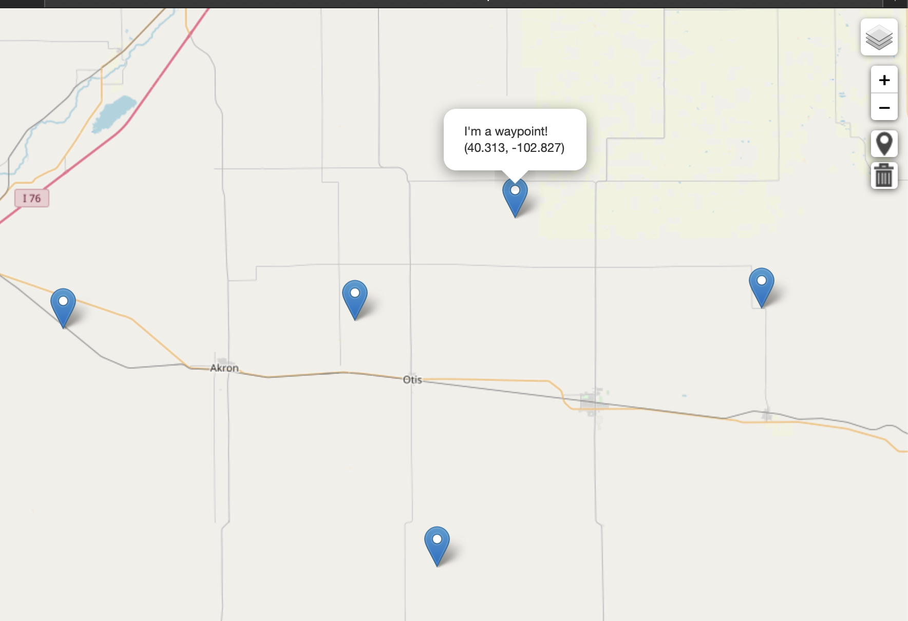

### Working With Waypoints

Use waypoints to mark rendezvous locations, critical road junctions, or other points on the map to aid navigation 
and balloon tracking efforts.  They can be added to the map screen with the HAB Tracker application, their popup 
content edited, and can even be moved to different locations.

It is important to note that waypoints will persist on your map until you either delete them or you reload the web 
page.  They do not persist across web page reloads (at least not yet).

## Adding a Waypoint To The Map

To add a waypoint onto your map click the  icon on the right hand side of the screen.  
Once selected it should turn a blue color to indicate that you're in "add a new waypoint" mode.  

Just click on your desired map location to add a waypoint at that spot.

